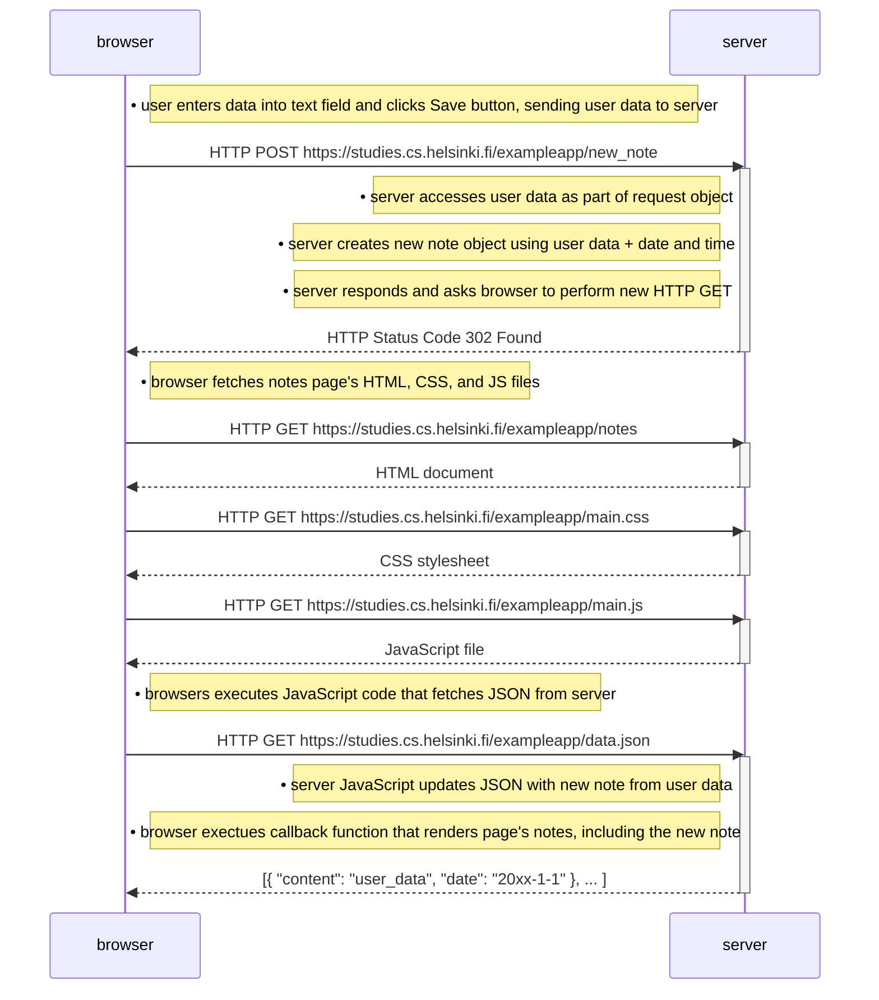

```mermaid
sequenceDiagram

	participant browser
	participant server
	
	note right of browser: • user enters data into text field and clicks Save button, sending user data to server
	
	browser->>server: HTTP POST https://studies.cs.helsinki.fi/exampleapp/new_note
	activate server
	
	note left of server: • server accesses user data as part of request object
	note left of server: • server creates new note object using user data + date and time 
	note left of server: • server responds and asks browser to perform new HTTP GET
	
	server-->>browser: HTTP Status Code 302 Found
	deactivate server
	
	note right of browser: • browser fetches notes page's HTML, CSS, and JS files
	
	browser->>server: HTTP GET https://studies.cs.helsinki.fi/exampleapp/notes
	activate server
	
	server-->>browser: HTML document
	deactivate server
	
	browser->>server: HTTP GET https://studies.cs.helsinki.fi/exampleapp/main.css
	activate server
	
	server-->>browser: CSS stylesheet
	deactivate server
	
	browser->>server: HTTP GET https://studies.cs.helsinki.fi/exampleapp/main.js
	activate server
	
	server-->>browser: JavaScript file
	deactivate server
	
	note right of browser: • browsers executes JavaScript code that fetches JSON from server
	
	browser->>server: HTTP GET https://studies.cs.helsinki.fi/exampleapp/data.json
	activate server
	
	note left of server: • server JavaScript updates JSON with new note from user data
	note right of browser: • browser exectues callback function that renders page's notes, including the new note
	
	server-->>browser: [{ "content": "user_data", "date": "20xx-1-1" }, ... ]
	deactivate server

```