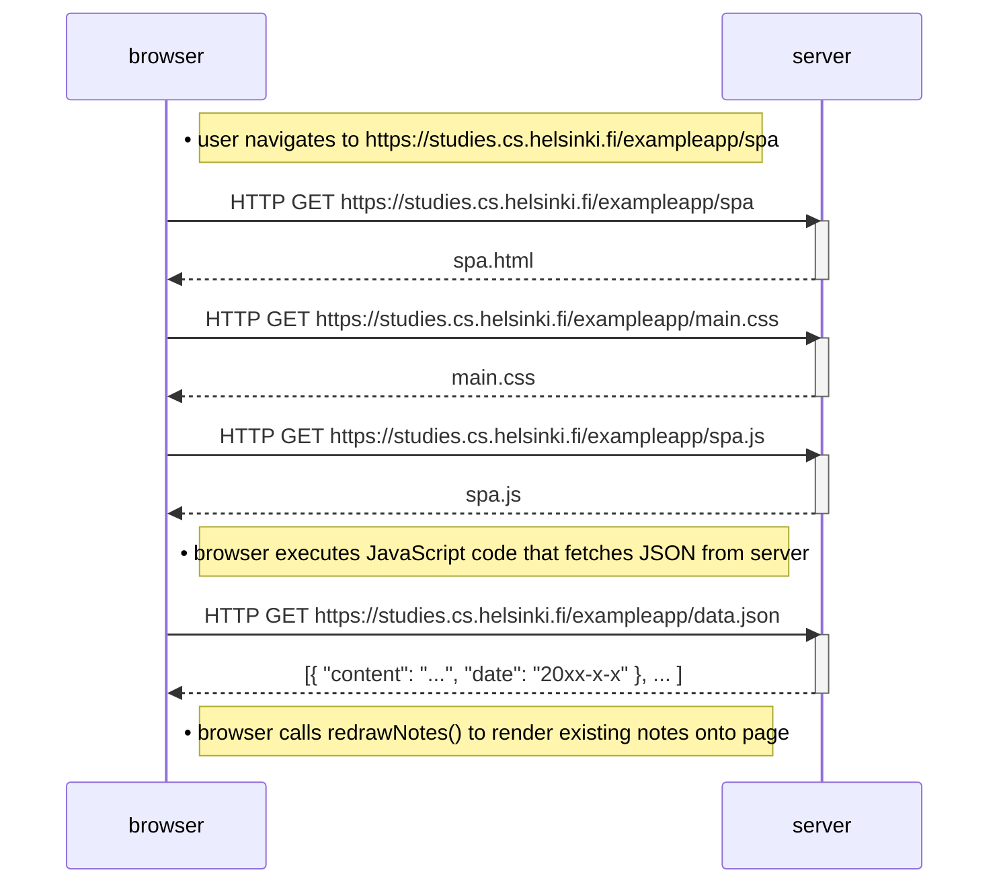

```mermaid
sequenceDiagram

	participant browser
	participant server
	
	note right of browser: • user navigates to https://studies.cs.helsinki.fi/exampleapp/spa
	
	browser->>server: HTTP GET https://studies.cs.helsinki.fi/exampleapp/spa
	activate server
	
	server-->>browser: spa.html
	deactivate server
	
	browser->>server: HTTP GET https://studies.cs.helsinki.fi/exampleapp/main.css
	activate server
	
	server-->>browser: main.css
	deactivate server
	
	browser->>server: HTTP GET https://studies.cs.helsinki.fi/exampleapp/spa.js
	activate server
	
	server-->>browser: spa.js
	deactivate server
	
	note right of browser: • browser executes JavaScript code that fetches JSON from server
	
	browser->>server: HTTP GET https://studies.cs.helsinki.fi/exampleapp/data.json
	activate server
	
	server-->>browser: [{ "content": "...", "date": "20xx-x-x" }, ... ]
	deactivate server
	
	note right of browser: • browser calls redrawNotes() to render existing notes onto page
```