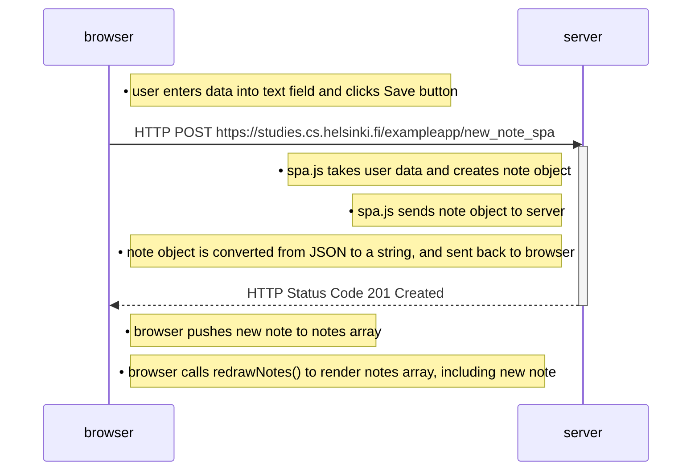

```mermaid
sequenceDiagram

	participant browser
	participant server
	
	note right of browser: • user enters data into text field and clicks Save button
	
	browser->>server: HTTP POST https://studies.cs.helsinki.fi/exampleapp/new_note_spa
	activate server
	
	note left of server: • spa.js takes user data and creates note object
	note left of server: • spa.js sends note object to server
	note left of server: • note object is converted from JSON to a string, and sent back to browser
	
	server-->>browser: HTTP Status Code 201 Created
	deactivate server
	
	note right of browser: • browser pushes new note to notes array
	note right of browser: • browser calls redrawNotes() to render notes array, including new note
	
```